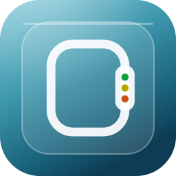
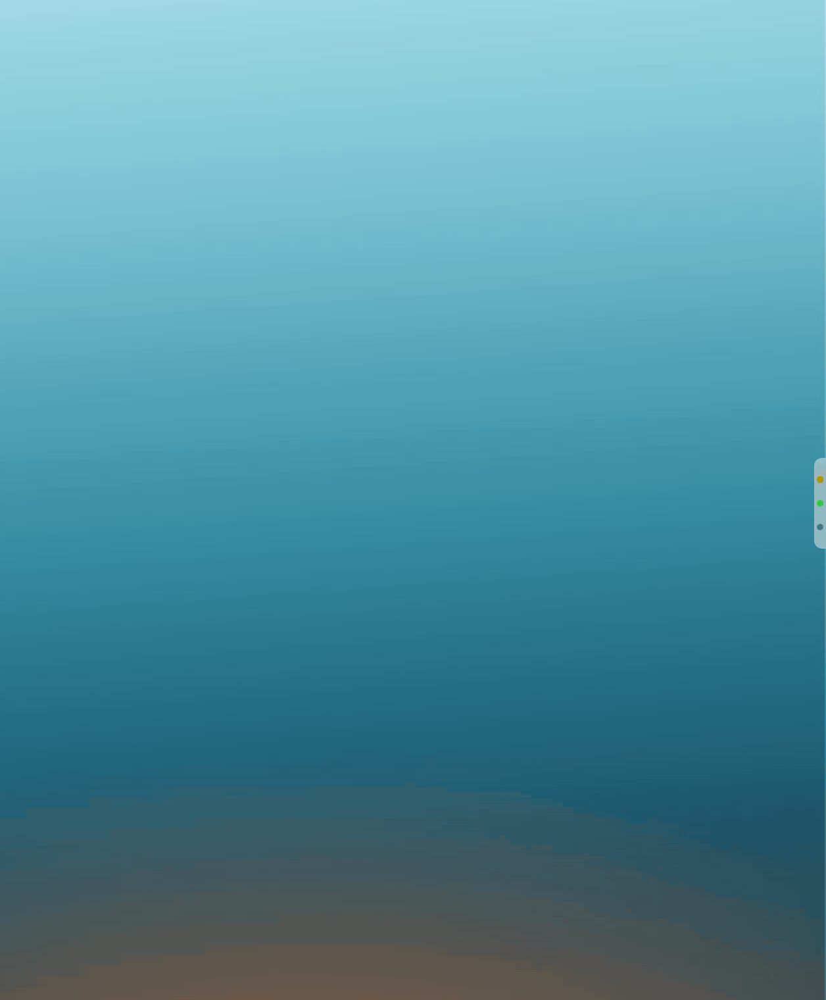
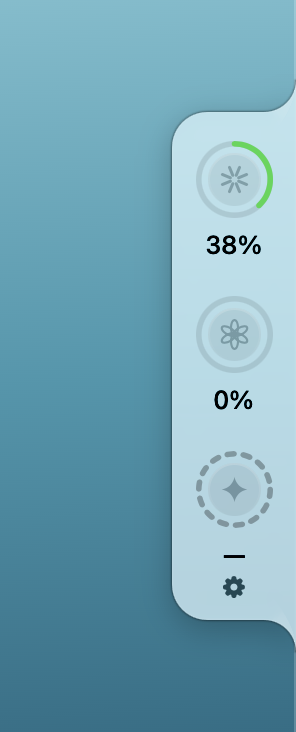
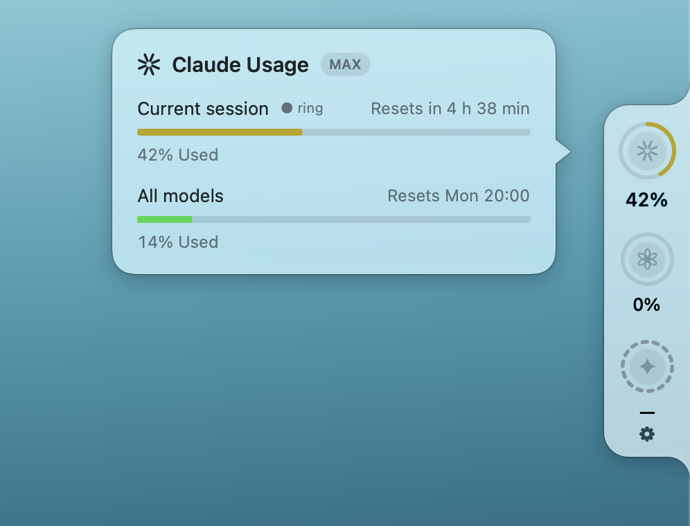
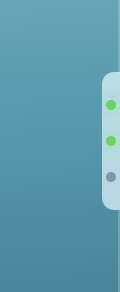
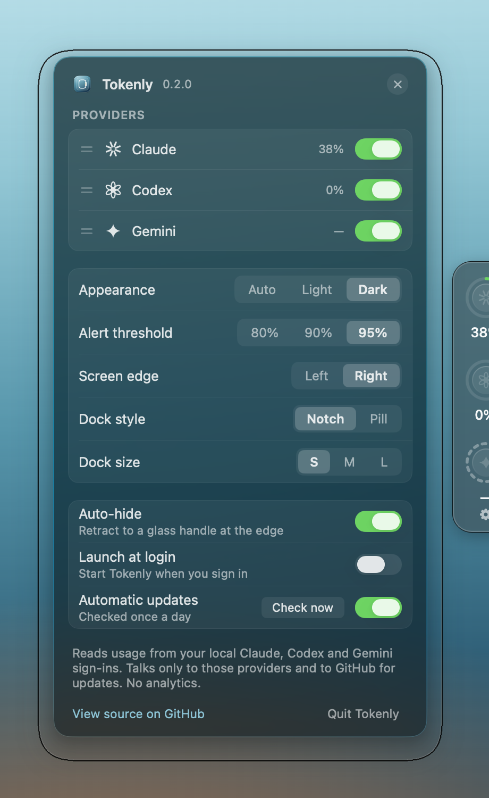
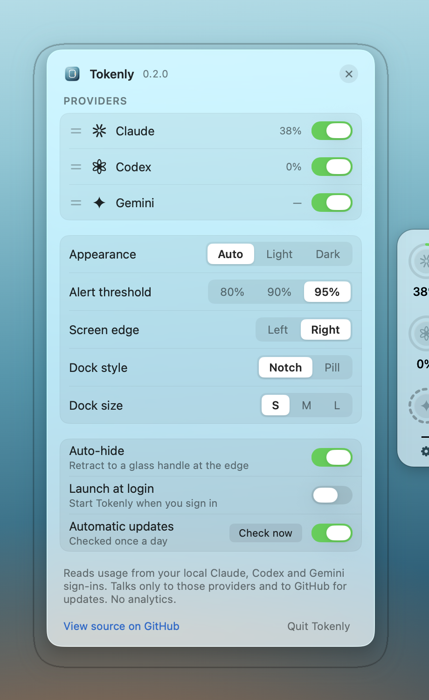
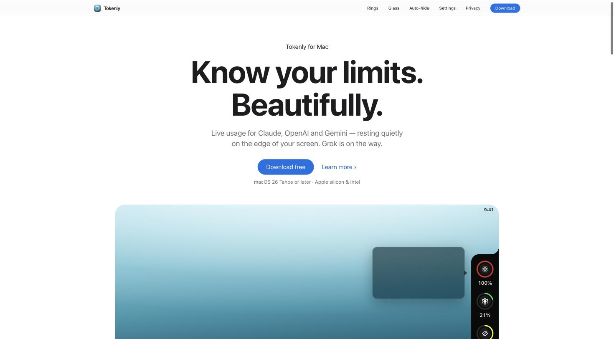
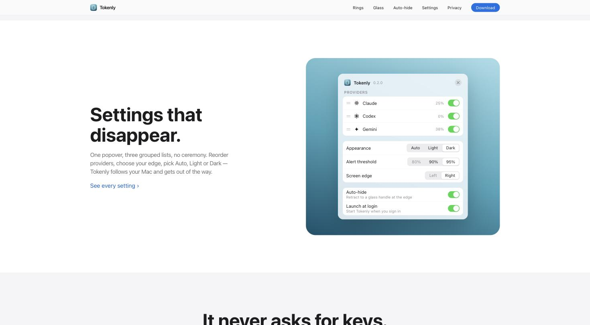
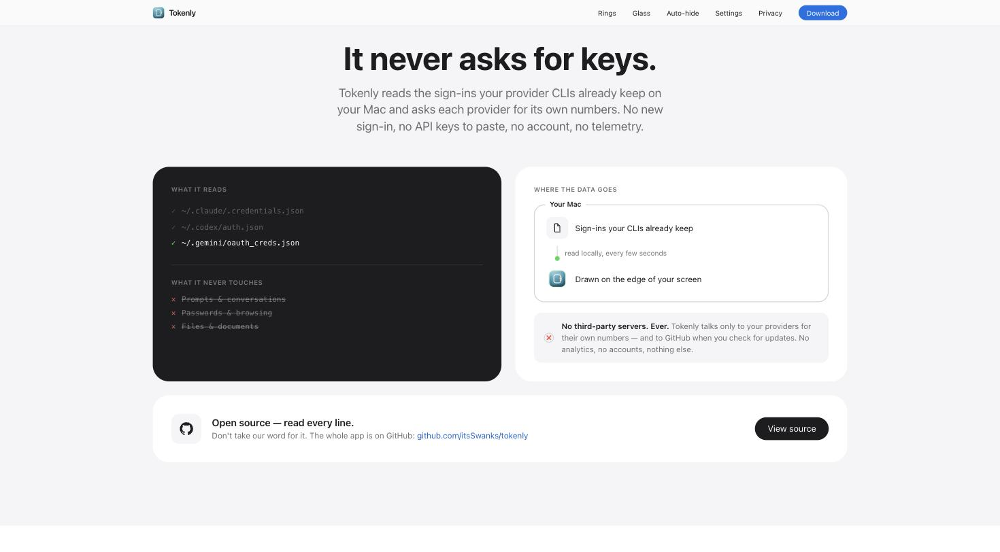

<div align="center">



# Tokenly

**Your AI usage limits, always in view — on the edge of your screen.**

Tokenly is a quiet macOS utility that shows how much of your Claude, Codex and Gemini
limits you have left. No dashboard to open, no tab to check. Just a glance.

[](#requirements)
[](#requirements)
[](https://github.com/itsSwanks/tokenly/releases)
[](LICENSE)
[](#privacy)



<sub>Live capture, real numbers. <a href="https://github.com/itsSwanks/tokenly/releases/download/v0.2.0/demo.mp4">Watch the HD video</a>.</sub>

</div>

---

## Why

You are three prompts into something good and the limit lands. No warning, no number,
no idea when it resets. Tokenly fixes exactly that — and nothing else.

- **Zero clicks.** The dock rests on your screen edge. Your limits are just *there*.
- **Color means urgency.** Green is calm, yellow is caution, red pulses. Readable across the room.
- **One honest alert.** A single glass banner at your threshold. Never twice, never nagging.
- **Nothing to hand over.** No account, no API keys to paste, no servers of its own, no telemetry.

---

## The dock

<div align="center"></div>

A slim Liquid Glass panel flush against your screen edge. One ring per provider, each showing
the percentage used of its session window.

| Ring color | Meaning |
| --- | --- |
| 🟢 `#32D74B` | under 40% — plenty left |
| 🟡 `#E4FF1A` | 40–69% — halfway (a deeper amber in Light Mode) |
| 🟠 `#FF4F1F` | 70–89% — getting close |
| 🔴 `#FF3B30` | 90%+ — **pulses** until it resets |

A dashed ring means **not available** — that account has no usage API to ask, or you are signed
out. Tokenly never estimates and never disguises anything: every number on screen came from the
provider that owns it.

**Interactions**

- **Hover** a ring → the usage callout condenses beside it
- **Click** a ring → pin the callout open
- **Drag** the dock → move it anywhere vertically
- **Right-click**, or the gear → settings

---

## Details, out of the frost

<div align="center"></div>

Hovering a ring blooms a frosted pane beside it: every usage window for that provider, its exact
percentage, and the time it resets. Your wallpaper glows straight through the glass, and the
pane's content sharpens out of a blur as it arrives — then melts away when you leave.

The callout moves *with* your cursor between rings: it glides to the ring you are pointing at
rather than reappearing somewhere new.

---

## Auto-hide

<div align="center"></div>

With auto-hide on (the default), the dock retracts fully off-screen, leaving a slim frosted
glass handle with three breathing glow dots — your provider statuses, reduced to fireflies.
Drift your cursor to the edge and the dock glides back.

Even hidden, you can still tell at a glance that something has gone red.

---

## Settings

One popover. Three grouped lists. macOS System Settings density, no ceremony.

<table>
<tr>
<td width="50%"></td>
<td width="50%"></td>
</tr>
<tr>
<td align="center"><b>Dark</b></td>
<td align="center"><b>Light</b></td>
</tr>
</table>

- **Providers** — toggle each on and off, drag the grip to reorder, live usage shown inline
- **Appearance** — Auto / Light / Dark (Auto follows your Mac, live)
- **Alert threshold** — 80% / 90% / 95%
- **Screen edge** — Left / Right
- **Dock style** — Notch / Pill (both Liquid Glass; the notch grows out of the edge through concave flares)
- **Dock size** — S / M / L
- **Auto-hide**, **Launch at login**, **Automatic updates**

Green means *on*. Nothing else in the UI is green, so an enabled switch and a healthy ring
are the only two things competing for your eye.

---

## Motion

Every animation is functional — it tells you where something came from or where it went.

| What | How it moves |
| --- | --- |
| Ring fill | Sweeps to its value, ~0.7 s |
| At 90%+ | The ring breathes on a 2 s loop |
| Callout, settings | Liquid Glass materializes in and dissolves out, ~0.4 s |
| Callout between rings | Glides to the ring you are pointing at, tail re-aiming as it goes |
| Auto-hide | The dock slides off while the glass handle crossfades in on the same clock |
| Glow dots | Three dots breathe out of phase |
| Hover and press | Springs — a small lift, a settle |

All of it respects **Reduce Motion** — springs become short fades, and nothing pulses.

---

## Privacy

**Nothing to sign into, nothing to hand over.** Tokenly reads the sign-ins your provider CLIs
already keep on your Mac and asks each provider for its own numbers:

| Ring | Reads | Talks to |
|---|---|---|
| Claude | `~/.claude/.credentials.json`, or the Keychain item Claude Code keeps | `api.anthropic.com` |
| Codex | `~/.codex/auth.json` | `chatgpt.com` |
| Gemini | `~/.gemini/oauth_creds.json` | `cloudcode-pa.googleapis.com`, `oauth2.googleapis.com` (token refresh) |

Sign in once with `claude`, `codex`, or `gemini` in Terminal and the ring lights up. Consumer
Google accounts (AI Pro/Ultra) are not entitled to the Code Assist quota API and show as
*not available for this account*.

What Tokenly never touches:

- ❌ Your prompts and conversations
- ❌ Your passwords, files or browsing
- ❌ Any server of its own — there isn't one

**No third-party servers. Ever.** Each token goes only to the provider that issued it, nothing
is ever written back to your credential files (a refreshed Gemini token lives only in memory),
and the only other host Tokenly contacts is GitHub, for the update feed. No analytics, no
accounts, no telemetry.

Two honest prompts you may see, both from macOS itself: reading the Claude Keychain item asks
once per app version (the ad-hoc signature changes with every build — click *Always Allow*),
and Tokenly only asks at all when the credentials file is missing or expired.

Don't take our word for any of this — the whole app is right here. Read every line.

---

## Install

**Download the latest release**

1. Grab `Tokenly-<version>.dmg` from [Releases](https://github.com/itsSwanks/tokenly/releases)
2. Drag Tokenly to Applications
3. macOS will refuse the first launch — **"Tokenly" Not Opened**, with only *Move to Trash* and
   *Done*. This is what an unsigned, anonymously published app looks like: there is no Apple
   Developer ID behind Tokenly and nothing notarized. Click **Done**, then either:

   - **Terminal** (always works, nothing to authenticate):

     ```
     xattr -dr com.apple.quarantine /Applications/Tokenly.app
     ```

   - or **System Settings → Privacy & Security**, scroll to *Security*, and click **Open Anyway**.

4. Open Tokenly — the dock appears on your right screen edge. It is a one-time step: updates
   arrive through Sparkle and do not repeat it.

Turning on **Launch at login** may need a second step: if the settings panel says so, approve
Tokenly in System Settings → General → Login Items & Extensions.

**Build from source**

Needs Xcode 26 (Swift 6.2+) and the macOS 26 SDK.

```bash
git clone https://github.com/itsSwanks/tokenly.git
cd tokenly
brew install xcodegen
cd Pulse && xcodegen generate
xcodebuild build -project Pulse.xcodeproj -scheme Pulse -configuration Debug -derivedDataPath build/dd
```

The Xcode project, its scheme and the Swift package keep their original `Pulse` names — those
are code, not brand; the built product is `Tokenly.app`. The data layer is the `PulseCore`
Swift package (`swift test` inside it; `swift run pulse-cli usage` prints your numbers in the
terminal).

### Requirements

- macOS 26 Tahoe or later
- Apple silicon or Intel
- At least one provider CLI signed in locally (Claude, Codex or Gemini)

Tokenly needs **no** accessibility permissions and **no** API keys.

---

## Website

**[tokenly.site](https://tokenly.site)**



<table>
<tr>
<td width="50%"></td>
<td width="50%"></td>
</tr>
</table>

---

## Roadmap

- **Grok ring** — needs browser-cookie auth rather than a CLI sign-in; being explored
- More providers — more models on the way
- Menu-bar-only mode for people who want zero screen furniture
- Per-provider alert thresholds
- Usage history sparklines

Ideas and bug reports welcome in [Issues](https://github.com/itsSwanks/tokenly/issues).

---

## Contributing

PRs welcome. Two house rules that keep the app feeling like itself:

1. **Green means "on."** Never use it for selection, focus, or decoration.
2. **Real numbers only.** A ring never shows a guess: if a provider cannot report, the ring
   goes dashed and says *not available* — never an estimate dressed up as a reading.

## License

MIT — see [LICENSE](LICENSE).

<div align="center">
<sub>Built for people who use AI all day and would rather not be surprised.</sub>
</div>
